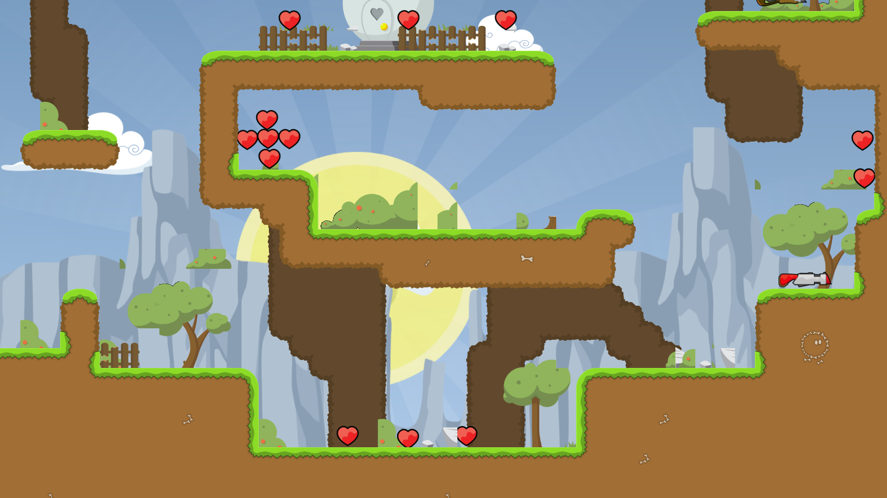
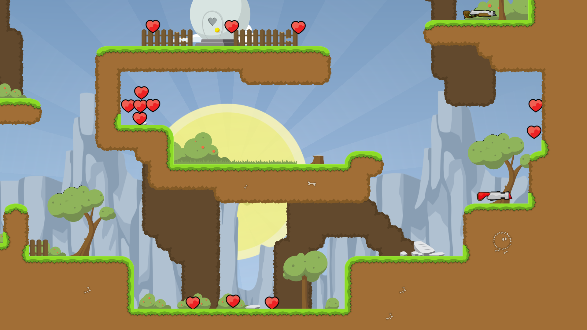

# twmap_6to7
python script using twmap to move doodads from 0.6 positions to 0.7 positions

## quickstart

You need python 3.9 or later

```
git clone git@github.com:ChillerDragon/teeworlds-map-convert-6to7
cd teeworlds-map-convert-6to7
pip install -r requirements.txt
./twmap_6to7.py ~/.teeworlds/maps/mymap.map mymap_07_doodads.map
```

## what and why

The tileset grass_dooads and some others got reordered in the update from 0.6 to 0.7
To properly load maps made in 0.6 in 0.7 clients ddnet came up with the [map_convert_07](https://github.com/ddnet/ddnet/blob/master/src/tools/map_convert_07.cpp) tool
which works by embedding all tiles which enforces the 0.6 look but also embeds standard tiles which increases the map size and breaks custom mapres setups (texture packs).


So this tool does not emebed the tiles but moves the doodads around so they can be loaded as non embedded native 0.7 mapres and they look the same.
Some things were changed so drastically that it looks a bit different after conversion. And some doodads got removed. So this tool can be configured to enable
a lot of warnings and also fail on warnings. So if you want to do conversations without compromise you can throw this tool at the map first and enable the ``-Wall -Werror``
flags and if it fails you can use ddnets [map_convert_07](https://github.com/ddnet/ddnet/blob/master/src/tools/map_convert_07.cpp) instead.

Here some example of the 0.6 dm1 map loaded in a 0.7 client. First the raw map and then it being converted with ``twmap_6to7.py ~/.teeworlds/maps/dm1_06.map ~/.teeworlds/maps/dm1_07.map``

dm1_06.map (before)


dm1_07.map (after convert)


## linting

```
pip install -r requirements/dev.txt
mypy .
pylint twmap_6to7.py
```
